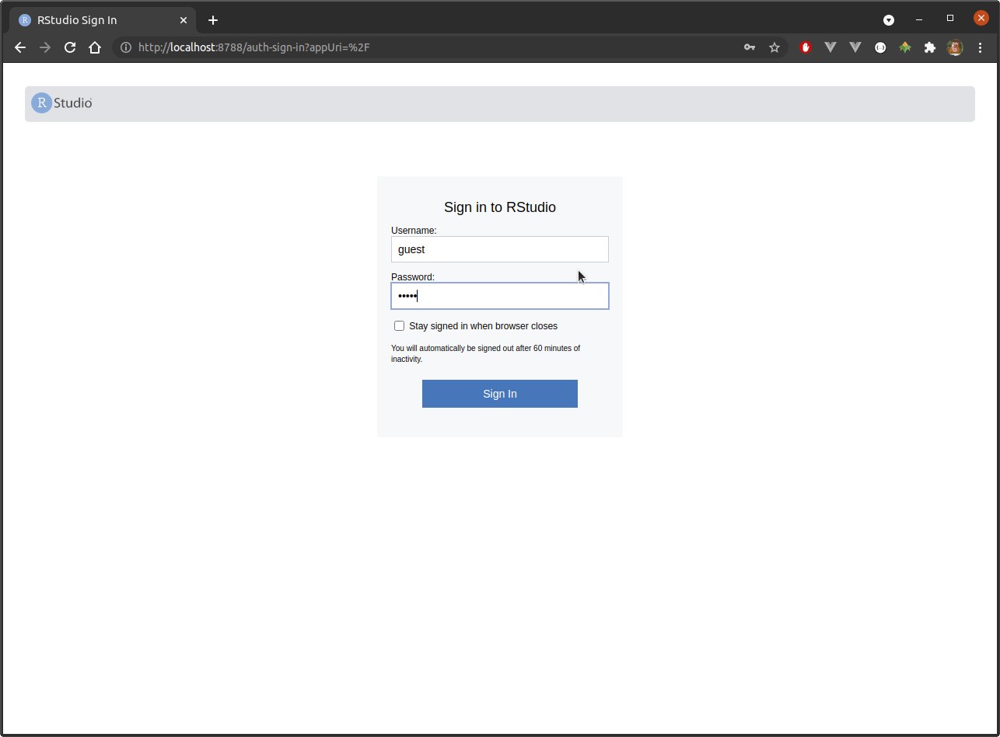

# Overview

folder | description | build* | run
-------|-------------|-------|-----
[development](development) | Container with small collection of build tools. | `docker-compose -f development.yml build` | `docker-compose -f development.yml up -d`
[seasadj](seasadj) | Containerised [seasonal adjustment service](https://github.com/cmhh/seasadj) | `docker-compose -f seasadj.yml build` | `docker-compose -f seasadj.yml up -d`
[seasadj](seasadj) | Containerised [seasonal adjustment service](https://github.com/cmhh/seasadj) with proxy | `docker-compose -f seasadjproxy.yml build` | `docker-compose -f seasadjproxy.yml up -d`
[ianz](ianz) | Containerised [Play Framework site](https://github.com/cmhh/ianzpoc) | `docker-compose -f ianz.yml build` | `docker-compose -f ianz.yml up -d`
[dashboard](dashboard) | Containerised [Shiny data portal](https://github.com/StatisticsNZ/data_portal) | `docker-compose -f dashboard.yml build` | `docker-compose -f dashboard.yml up -d`
[resnet](resnet) | Containerised image classifier | `docker-compose -f resnet.yml build` | `docker-compose -f resnet.yml up -d`
[adventureworks](adventureworks) | Containerised MS SQL Server with AdventureWorks pre-loaded | `docker-compose -f adventureworks.yml build` | `docker-compose -f adventureworks.yml up -d`
[rstudio](rstudio) | Containerised R and RStudio Server | `docker-compose -f rstudio.yml build` | `docker-compose -f rstudio.yml up -d`
analytics | Containerised R and RStudio Server with SQL Server | `docker-compose -f analytics.yml build` | `docker-compose -f analytics.yml up -d`
[registry](registry) | [Docker registry with UI](https://github.com/Joxit/docker-registry-ui) | `docker-compose -f registry.yml build` | `docker-compose -f registry.yml up -d`

* Note that building is optional&ndash;images will be automatically built on run if they don't exist already.

# `development`

This example includes a single image with several runtimes and compilers, and the sbt build tool.  Once up and running, users can connect to a container remotely from Visual Studio Code.  Development _feels_ local, but all artefacts are built and executed inside the running container, not on the host OS.


Of course, the is just an example, and in a real-world setting you would likely curate a number of different images, each suitable for a particular target or use case.  For example, one for Play Framework services, one for Spring Boot services, one for Node.js, one for .NET Core services, and so on.


# `seasadj`

This example demonstrates deployment of a simple web service.  In this case, the service is a stateless (results are briefly saved to disk in `/tmp`, but then deleted) wrapper around [X13-ARIMA-SEATS](https://www.census.gov/data/software/x13as.html).  The example also includes a naive implementation of a side-car proxy (via [envoy](https://www.envoyproxy.io/)) to demonstrate how one might go about authentication (via [Open Policy Agent](https://www.openpolicyagent.org/)) using entirely open source components.


The `seasadj` directory contains a simple JSON input as [](seasadj/airpassengers.json), which looks as follows:

```json
{
  "ap": {
    "series": {
      "title": "Air Passengers",
      "start": 1958.01,
      "data": [
        340.0, 318.0, 362.0, 348.0, 363.0, 435.0, 
        491.0, 505.0, 404.0, 359.0, 310.0, 337.0, 
        360.0, 342.0, 406.0, 396.0, 420.0, 472.0, 
        548.0, 559.0, 463.0, 407.0, 362.0, 405.0, 
        417.0, 391.0, 419.0, 461.0, 472.0, 535.0, 
        622.0, 606.0, 508.0, 461.0, 390.0, 432.0
      ]
    },
    "x11": null
  }
}
```

To call the service avoiding the proxy:

```bash
curl \
  -X POST \
  -H "Content-Type: application/json" \
  -d @seasadj/airpassengers.min.json \
  localhost:9004/seasadj/adjust \
  --compressed --output airpassengers.output.json
``` 

To call the service via the proxy:

```bash
curl \
  -X POST \
  -u guest:password \
  -H "Content-Type: application/json" \
  -d @seasadj/airpassengers.min.json \
  localhost:8800/seasadj/adjust \
  --compressed --output airpassengers.output.json
```

The authentication example here is very naive, and user 'guest' with password 'password' is the only usable combination.  Still, without it the proxy will return a 403 error, which is all we're trying to show here.

# `ianz`

This example shows a very basic example of a containerised static website rendered using [Twirl templates](https://www.playframework.com/documentation/2.8.x/ScalaTemplates) via [Play Framework](https://www.playframework.com/).  The website parses files found in a subfolder on start-up, and so can be redeployed with different sets of inputs.


# `dashboard`

This example shows a very basic of a containerised R Shiny application.  The specific example here is [Stats NZ Data Portal](https://github.com/StatisticsNZ/data_portal).  The application reads a configuration on start-up, so, like the `ianz` example, can be redeployed with different sets of inputs.


# `resnet`

This example shows an example of a containerised [Flask](https://flask.palletsprojects.com/en/2.0.x/) application.  The application itself takes an uploaded image and classifies it using a pretrained ResNet using [TensorFlow](https://www.tensorflow.org/). 

The service provides a basic web form if accessed in a browser directly, but can be called directly via `curl` easily enough.  For example, to classify:


run:

```bash
curl -s -F "file=@resnet/test/dog03.jpg" \
  localhost:5000/resnet/predict | jq 
```
```json
[
  [
    "n02107683",
    "Bernese_mountain_dog",
    0.7324879765510559
  ],
  [
    "n02106166",
    "Border_collie",
    0.13115738332271576
  ],
  [
    "n02107908",
    "Appenzeller",
    0.12724290788173676
  ],
  [
    "n02106030",
    "collie",
    0.004319412633776665
  ],
  [
    "n02108000",
    "EntleBucher",
    0.0026267936918884516
  ]
]
```

# `adventureworks` (MS SQL Server)

This example simply takes a MS SQL Server image and loads the AdventureWorks database for demonstrative purposes.


# `rstudio`

This example provides R and RStudio Server.  RStudio Server can be accessed on the host OS via a web browser.  This provides the ability to use the Linux version of R on Windows, for example, so that we can ensure consistency across a whole user base whether users are using a centralised server or their own desktop, for example.




# `analytics`

This example is essentially the same as the `rstudio` example, but we also attach the `adventureworks` version of SQL Server.  This is a simple demonstration of an analytical environment consisting of multiple containers.  In this case, we can use SQL Server to store objects that are too big to fit within memory, so which can't easily be analysed directly in R otherwise.  The idea could be extended to other popular analytical tools easily enough&ndash;JuptyerLab, Spark Notebooks, and so on.

In this case, we can access the database by hostname (`database`) by running the following R code:

```r

library(RJDBC)

# connect to SQL Server --------------------------------------------------------
ip <- "database"
p <- "jar/mssql-jdbc-8.4.1.jre8.jar"
drv <- RJDBC::JDBC("com.microsoft.sqlserver.jdbc.SQLServerDriver" , p)

conn <- DBI::dbConnect(
  drv,
  sprintf(
    "jdbc:sqlserver://%s:%d;databaseName=%s;username=%s;password=%s",
    ip, 1433, "adventureworks", "sa", "password-1234"
  )
)

# extract address table --------------------------------------------------------
address <- DBI::dbGetQuery(
  conn, 
  "
  SELECT * from [SalesLT].[Address]
  "
)

# tidy up ----------------------------------------------------------------------
DBI::dbDisconnect(conn)
```


# `registry`

This example simply runs the standard registry image provided by Docker, but adds a simple web UI sourced from [joxit/docker-registry-ui:static](https://github.com/Joxit/docker-registry-ui).

To tag a local image and add it to the registry, run, for example:

```bash
$ docker tag rstudio:ubuntu20.04-4.0.3 localhost:8080/rstudio:4.0.3
$ docker push localhost:8080/rstudio:4.0.3
```

The image can then be pulled from any machine that can see the registry by running:

```bash
$ docker pull localhost:8080/rstudio:4.0.3
```

